# NMDA2022 ——基于脑电的跨个体情绪识别

## 数据预处理

在此次作业中，原始数据为THU-EP数据集，包含80位受试者，每位受试者采集了32通道，每通道1832s（采样率125Hz）的完整脑电数据。利用mne库，我们依据项目信息建立了info类，将数据文件导入转化为raw类，对其波形进行了可视化，如图1所示。

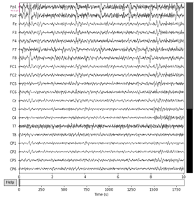
图1

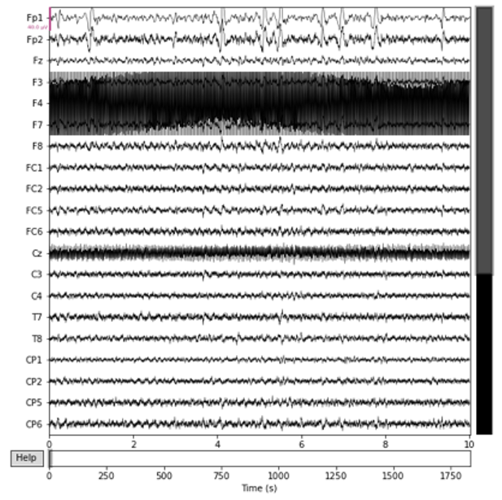
图2

使用Standard 10-20电极放置位置设置Montage，然后利用脑电绝对值及ICA成分来进行分析、去除坏道，主要的依据是绝对值超过80uV或者在ICA上表现为单通道组成了一个强成分，如图2、图3所示。

图2中靠前的几个成分需要加以额外注意，例如ICA000、ICA001，结合图2，表示F4通道为坏道；而ICA002为眨眼成分，ICA007为眼动成分，同样需要剔除。 

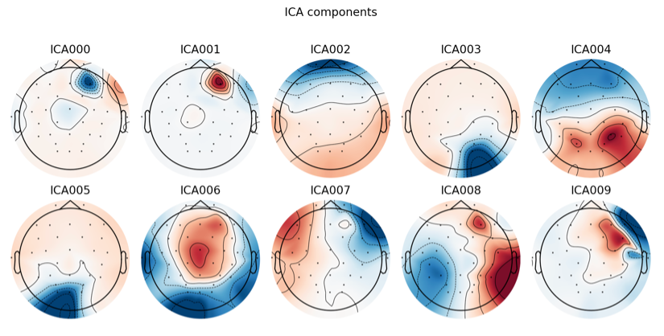
图3

通过观察，我们发现有部分受试者脑电坏道、坏段明显（如图4所示），乃至全程均为坏道，为了保持数据的一致性，予以在数据中剔除（受试者16号、22号两人）。在此之后，主要通过ICA方法进行眼电伪迹、肌电伪迹等的去除。

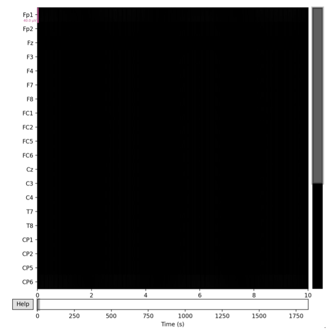
图4 坏道、坏段展示 #16
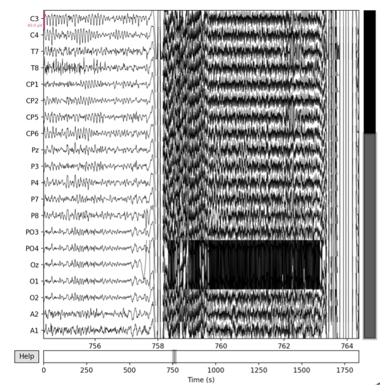
图5 坏道、坏段展示 #22

在完成两步预处理后，将数据从raw格式重新转化为numpyArray格式，为了保证情绪的连贯性以及强烈程度，我们选取了每一段视频放映最后的30秒作为数训练数据，最终可以用于训练的数据格式为（78，28，30*125，32），标签为（78，28）。

## 模型及方法

我们主要实现了两种基于CNN的模型，`EEG1D` 分别使用一维卷积整合（spatial）和时间（temporal）纬度的信息，`EEG2D` 使用二维卷积将形状为$(time*frequency, channel)$ 的输入视为整体处理。

在实验中我们发现，直接将eeg的通道和时间信息视为二维矩阵训练不稳定，容易出现 loss Nan 的问题，这可能与预处理时发现的不同通道间信号差距较大有关；此外二维卷机计算开销大，训练慢（同等参数量情况下使用二维卷积比使用组合的一维卷积慢了十倍以上），因此没有在 `EEG2D` 上开展过多实验。

我们参考 [pytorch EEGNet](https://github.com/s4rduk4r/eegnet_pytorch) 和论文 [^1] [^2] 中的超参数设置实现了分别在通道和时间层面上做1维卷积的处理方式，具体请参考 `model.py` 中的 `EEGNet` 类。

```python
# EEG1D
# 实现通道（spatial）间的卷积
# In: (B, Chans, Samples)
# Out: (B, F1, Sample)
self.conv1 = nn.Conv1d(Chans, F1, spacial_kernLength, padding=(spacial_kernLength // 2))
# 选择是否使用batchnorm，由于不同通道间信号存在差距，不同个体间的原始输入也存在差异因此需要具体探究是否使用
self.bn1 = nn.BatchNorm1d(F1) if batch_norm else nn.Identity() # (B, F1, Samples, 1)

# 实现信号（temporal）层次的卷积
# In: (B, F1, Samples)
# Out: (B, F2, Samples - Chans + 1)
self.conv2 = nn.Conv1d(F1, F2, Chans, groups=F1)
self.bn2 = nn.BatchNorm1d(F2) if batch_norm else nn.Identity() # (B, F2, Samples - Chans + 1)
self.dropout = nn.Dropout(dropoutRate)

# 实现每一个通道单独进行的卷机
# In: (B, F2, (Samples - Chans + 1))
# Out: (B, F2, (Samples - Chans + 1))
self.conv3 = SeparableConv1d(F2, F2, kernel_size=temporal_kernLength, padding=(temporal_kernLength // 2))
self.bn3 = nn.BatchNorm1d(F2) if batch_norm else nn.Identity()
# In: (B, F2, (Samples - Chans + 1))
# Out: (B, F2, (Samples - Chans + 1))
self.avg_pool2 = nn.AvgPool1d(30)
# In: (B, F2 *  (Samples - Chans + 1) / 30)
self.fc = nn.Linear(F2 * ((Samples - Chans + 1) // 30), nb_classes)
```

我们首先进行了通道层面的一维卷积，将原始的32通道信息整合到新的F1个通道中；此后我们使用信号层面的卷积，将F1个通道中每个通道的信息用D个长度为原始通道数的卷积核处理，这样获得了 F2=F1*D 个通道的信息；最后我们对F2个通道中信息分别用F2个长度为 temporal_kernLength 的卷积核处理，并使用窗口数为30的 average pooling 降低特征维度，并使用 linear 层输出。在不同层之间，我们加入了relu激活函数；我们还测试了加入 dropout 和 batchnorm 的影响。

处理预处理数据，我们还在训练过程中综合考虑了跨个体的影响。在原始的EEGNet实现中，BatchNorm 常常和卷积联合使用，但是考虑到同一个batch中不同个体的信号可能存在较大差距，测试了使用batch norm的影响。此外，我们还参考 [^1] 实现了基于 contrastive learning 的对齐跨个体信号的方法，我们接下来介绍从EEG1D获取用于分类和contrastive learning的特征，具体contrastvie learning的实现细节将在下一部分介绍。

```python
def forward(self, x: torch.Tensor, output_feature=False):
    # x: (batch size, channels, samples)
    # samples = seconds*frequence
    # spacial conv
    y1 = self.conv1(x)
    y1 = F.relu(self.bn1(y1))
    # temp conv1
    y1 = self.conv2(y1)
    y1 = F.relu(self.bn2(y1))
    y1 = self.dropout(y1)
    # temp conv2 (对处理得到的每一个通道信息分别处理增强)
    y2 = self.conv3(y1)
    y2 = F.relu(self.bn3(y2))
    y2 = self.dropout(y2)

    # 最终获取特征，我们尝试了直接转化和利用人为设计的特征的两种方法，
    # 分别在 model.py中的 EEGNet 和 EEGNetv2中实现。
    # EEGNet 中经过pooling后直接将特征展平
    if EEGNet：
        y2 = self.avg_pool2(y2) # 利用长度为30的avg pooling降低维度
        y2 = torch.flatten(y2, 1)
    # EEGNetv2 中参考[^1]中的方法进一步处理，避免overfit
    elif EEGNetv2:
        y2 = 0.5*torch.log(2*math.pi*math.e*torch.std(y2, dim=-1, unbiased=False))
    
    # 获取特征后，根据所处的训练阶段输出
    if output_feature:
        # 如果用于对比学习，则直接将特征输出
        return y2
    else: 
        # 如果用于监督学习，使用linear层将特征转化为分类logits
        return self.fc(y2) 
```

以上 `forward` 函数具体展示了我们组合使用一维卷积的EEGNet处理输入特征的过程。为了将经过多个卷积核处理过后的高维信息（大小为$(B, F2, (Samples - Chans + 1))$, 其中 F2, Samples 都为 $10^2$ 量级）进行适当降维以减少过拟合，我们分别将采用了 average pooling 和 [^1] 中使用的 differential entropy (DE)；在获取完特征后，如果进行监督学习，则将特征进一步经过线性层获得分类logits；如果进行对比学习，则直接输出与特征。

我们还在 [pytorch EEGNet2D](https://github.com/aliasvishnu/EEGNet/blob/master/EEGNet-PyTorch.ipynb) 的基础上，尝试调整2维卷积大小实现了和使用一维组合卷积的EEGNet参数量相似的网络，如下图所示。

```python
# Layer 1
self.conv1 = nn.Conv2d(1, 64, (1, 32), padding = 0)
self.batchnorm1 = nn.BatchNorm2d(64, False) if batch_norm else nn.Identity()
# Layer 2
self.conv2 = nn.Conv2d(1, 64, (1, 60), stride=(1, 1))
self.batchnorm2 = nn.BatchNorm2d(64, False) if batch_norm else nn.Identity()
self.pooling2 = nn.AvgPool2d((1, 30), (1, 2))
# Layer 3
self.conv3 = nn.Conv2d(64, 3, (16, 6), (2, 1))
self.batchnorm3 = nn.BatchNorm2d(3, False) if batch_norm else nn.Identity()
self.pooling3 = nn.AvgPool2d((6, 3))
self.fc1 = nn.Linear(48, nb_classes)
```

然而我们在实验中发现，较大的2维卷积核在面对大小为 $32*125$ 的EEG信号输入时运算量远远大于1维卷积核的组合，因此我们只在最后使用了一组 $16*6$ 的卷积核，但是同样的参数量大三层网络比之前慢了10倍，并且在我们多次调整训练策略后依然存在着loss发散的问题，因此我们没有过多在 EEG2D 上实验。

## 实现细节及超参

### 监督学习

我们在 `train.py` 中的 `train()` 具体实现了监督学习的过程。由于我们采用的训练数据原始数据大小为 $(80, 28, 30*125, 32)$，我们在最初实现 dataset（见`dataset.Onesec_Dataset`） 时将其改为 $(80*28, 30*125, 32)$，每一次取大小为256的batch，其中EEG信号大小为$(256, 30*125, 32)$，标签大小为$(256, )$。由于在预测时需要对同一个trail中每一秒数据的情感进行预测，这意味着我们要将标签连续使用30次。我们这样带来的不同batch间的巨大差距（同一个batch内连续30步训练使用的都是一样的标签，而一换batch所有的标签都会发生变化）可能会给训练带来一些问题，后续实验部分中预处理的作用也展示了一次训练完一整个trail中的带来loss的周期性变化。由此，我们将数据改为$(80*28*30, 125, 32)$放入dataloader（在运行`main.py`时选择`--total_shuffle`），并将对应的label也通过重复三十次改为$(80*28*30,)$，而后随机打乱。如此处理能够使得每次更新中使用的都是在所有trail中随机独立选取的1s数据，这使得我们能够更好地利用batch近似整个数据集。

我们参考[^1]中的超参设置，选择了 F1=16, D=16 的网络参数，使用 batc_size=256, epochs=100, learning_rate=0.0005。所有实验都采用了Adam优化器。我们将在实验部分具体展示这些参数的影响。

### 对比学习

我们在 `train.py` 中的 `contrastive_train()` 参考[^1]实现了对比学习。不同于常见的对比学习可以直接通过标签是否相同来判断正负参考，或者通过data augmentaion来方便得获取用于对比的样本，我们在跨个体情绪识别的任务中，除了希望同一个个体看到相同内容时的特征要尽可能的相似，还希望不同个体的这一对应特征也尽可能相似，进而能是模型具有跨个体分类的能力。对此，我们参考[^1]中的做法，将一组两名被试中同一个trial中同一段时间的数据作为正向的参考对，并将它们与两名被试的其它trail中不同段时间的比较，获得如[^1]中式（7）的 contrastive loss 计算。

在具体实现上，由于直接使用监督学习的 dataset 在获取batch数据后再来构建 contrastive pair 较为复杂，我们重新实现了 `dataset.Contrastive_Dataset`：

```python
Contrastive_Dataset(Dataset):
"""
实现正负样本选择匹配的Dataset, 方便contrastive loss计算
Args:
   data: 原始数据，形状为（被试数，trail，采样频率*每段总时间，通道数）
   seconds: 每段总时长，我们选取30s
   sample_interval: 选择用于contrastive learning的片段长度，默认为5s
   frequency: 采样频率，在本问题中为 125Hz
   neg_number: 在计算contrastive loss时选取的参考数，最后计算contrastive loss时分母有 2*neg_number+1 项
"""
def __init__(self, data:torch.Tensor, # 80, 28, 3750, 32
                seconds:int = 30,
                sample_interval:int = 5,
                frequency:int = 125,
                neg_number:int = 10,
                channel_wise_normalize:bool = False,
                device='cpu'):
    assert neg_number < 28, "number of negtive references should be smaller than number of trails"
    assert sample_interval < 30, "length of reference should be smaller than trail length"
    self.seconds = seconds
    self.frequency = frequency
    self.sample_interval = sample_interval
    data.to(device)
    if channel_wise_normalize:
        data = F.normalize(data, dim=1)
    self.data = data
    self.total_trial = self.data.shape[1]
    self.neg_number = neg_number

def __getitem__(self, index): # index 为样本A
    # 从总的 trail 数中 不重复地 选择neg_number+1个trial
    ref_trails = random.sample(range(self.total_trial), k=self.neg_number+1)
    # 将其中的1个作为正参考，如此实现避免了重复选择
    pos_index = ref_trails[0]
    # 随机在trial的30s中选取一段用于计算feature
    interval = random.randint(0, self.seconds-self.sample_interval-1)
    # 随机在所有被试样本中选取一个作为参考B
    ref_sample = random.randint(0, self.data.shape[0]-1)
    ref_sample = (ref_sample + 1)%self.data.shape[0] if ref_sample==index else ref_sample # 避免重复及索引超出范围
    # 将样本A与样本B的用于计算contrastive loss分母部分组合
    neg_samples = torch.cat((self.data[index, ref_trails[1:], interval*self.frequency:(interval+self.sample_interval)*self.frequency],\
        self.data[ref_sample, ref_trails, interval*self.frequency:(interval+self.sample_interval)*self.frequency]), dim=0)
    # 返回样本A，样本B中的pos reference及neg reference
    return self.data[index, pos_index, interval*self.frequency:(interval+self.sample_interval)*self.frequency],\
        self.data[ref_sample, pos_index, interval*self.frequency:(interval+self.sample_interval)*self.frequency],\
        neg_samples
```

在 `Contrastive_Dataset.__getitem__()` 中，我们实现了每次根据索引构建contrastive pair：由输入的index选择一个被试的数据，并随机选择一个trial；在trail中随机选择 sample_interval（我们尝试了1s，3s和5s）的数据；随机选择另一名被试，并将同一个trial中的同一段数据作为正向参考；在两名被试数据的其它trial中随机选择 neg_number 数量的 trial，并在这些trial中选取同样长度的片段，共同构成负向参考。另外我们还为两个dataset都保留了 channel_wise_normalize 和 device 参数，前者为选择是否将原始数据按照通道标准化，后者为初始化数据的位置。由于 Contrastive_Dataset 在获取数据时需要进行较多索引操作，不将数据初始化在 GPU 上会导致训练的时候 CPU 负载过大，影响训练效率，因此我们将数据直接初始化在 GPU 上，消耗1G多的显存来提高训练效率。

在 `utils.contrastive_loss()` 中，我们实现了基于对应的 contrastive loss 计算：

```python
def contrastive_loss(test_feature, pos_ref, neg_ref):
    # 为了方便余弦相似度计算，首先将每一个 feature 标准化，然后整理成方便矩阵乘法的形式
    test_feature = F.normalize(test_feature, dim=-1).unsqueeze(1) # bs, 1, feature dim
    pos_ref = F.normalize(pos_ref, dim=-1).unsqueeze(2) # bs, feature dim, 1
    neg_ref = F.normalize(neg_ref, dim=-1).transpose(1, 2) # bs, 2*ref_trails+1, feature dim
    # 计算式（7）分子项：
    pos = torch.bmm(test_feature, pos_ref)
    # 计算式（7）分母项：
    neg = torch.bmm(test_feature, neg_ref)
    sum_exp_neg = torch.exp(neg).sum(2, keepdim=True) # 先求指数再求和
    # 计算论文中式（7）
    log_prob = pos - torch.log(sum_exp_neg)
    contrast_loss = -log_prob.mean()
    return contrast_loss
```

我们参考[^1]中的超参设置，选择了 sample_interval=1,3,5（受显存限制我们主要在 interval=3 的情况下实验）, neg_number=5,10,15,20,25,27 ，使用 batc_size=40, epochs=5000（注意一个epoch内只会取两个batch）, learning_rate=0.0005。我们将在实验部分具体展示这些参数的影响。

### 其它细节

我们在 `main.py` 中实现了参数选择，为不同参数设置的实验设置单独的记录与储存模型的路径，利用 tensorboard 记录训练过程中 loss 及 accuracy 的变化等。

## 实验结果

这一部分的实验结果都由tensorboard中记录的训练曲线来展示；注意不同实验基本都由对应的实验参数确定；例如下图中文件夹名supervised表示这是进行监督学习的结果，EEG1D表示使用的网络为的EEG1D，文件名中的F1, D, dropout, norm 分别对应着 `main.py` 中不同的 args 设置。

这些实验大致得出结论：

1. 数据预处理有很大影响
2. contrastvie learning 对于后续训练有帮助
3. 模型容易在训练集overfit
4. 其余设置（dropout，weight_decay）等影响较小

### 在未处理过的数据集上使用normalize

这一部分实验我们主要在只提取合适时间段、未经过近一步处理的数据集上进行，并且没有近一步打乱数据集（未使用 `--total_shuffle`，单个batch 包含同一个trial的全部信息，连续更新30步），并主要使用EEG1D。

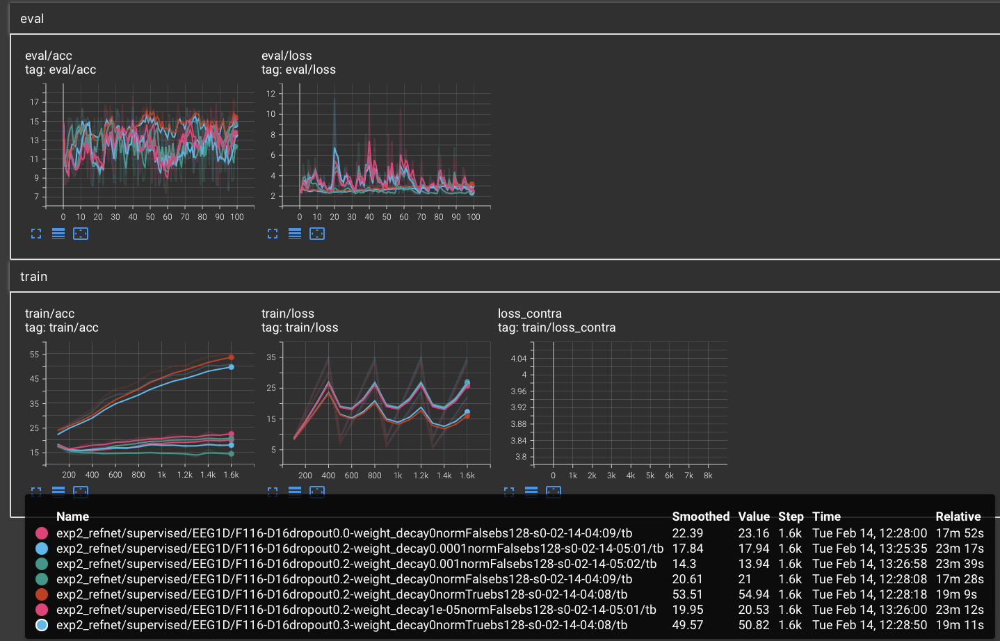
图一

图一中主要展示了在初始化数据集时进行的 channel_wise_normalize 的影响，可以看到进行标准化后的两组实验训练准确率提升得很快，而剩下的几组实验准确率几乎就停在了不到30%；这说明不加处理的原始数据较为复杂，直接用于训练比较困难。此外可以注意到dropout和weight_decay等虽然对于训练准确率有一些影响，但是对于测试准确率影响非常不明显。

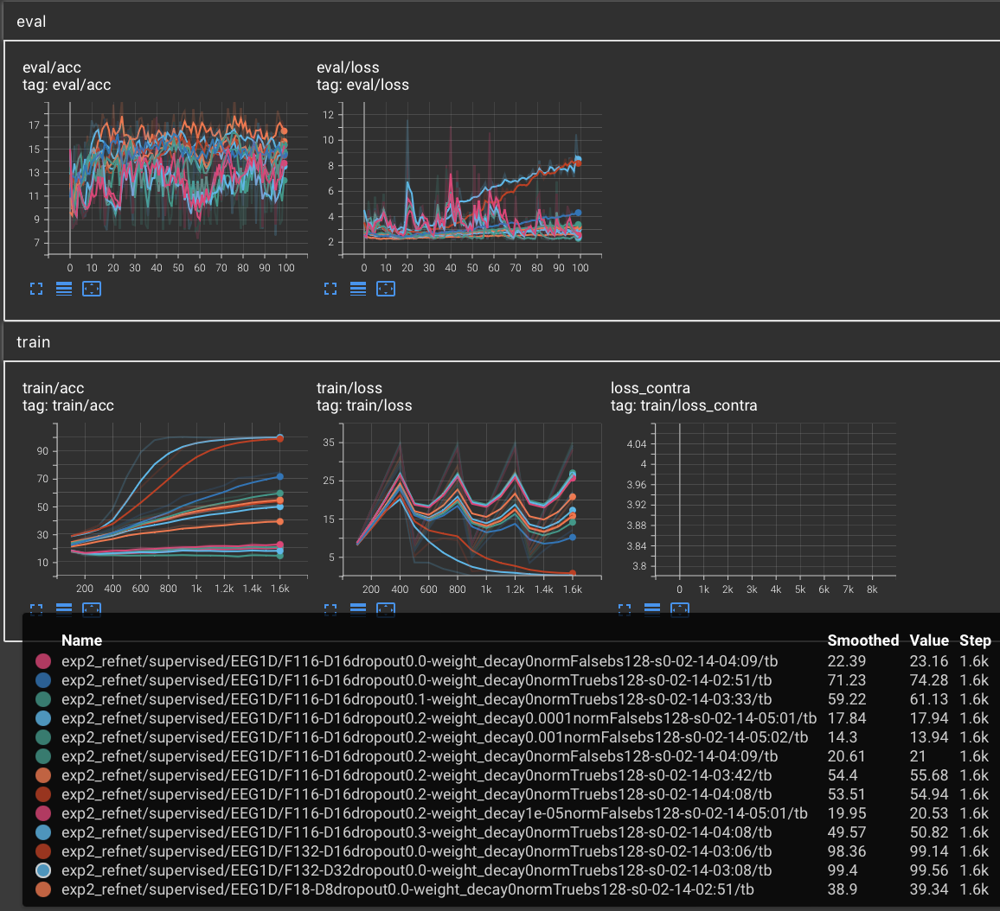
图二

图二中的实验在近一步验证了normlize的明显影响后，还展示了dropout对于减轻在训练集上迅速拟合的效果：在训练到相同epoch时，高dropout的模型训练准确率较低。此外还可以看到模型参数量对于拟合训练集的影响：F1=32、D=32，F1=32、D=16，F1=16、D=16情况下训练集拟合的速度有着明显的区别。

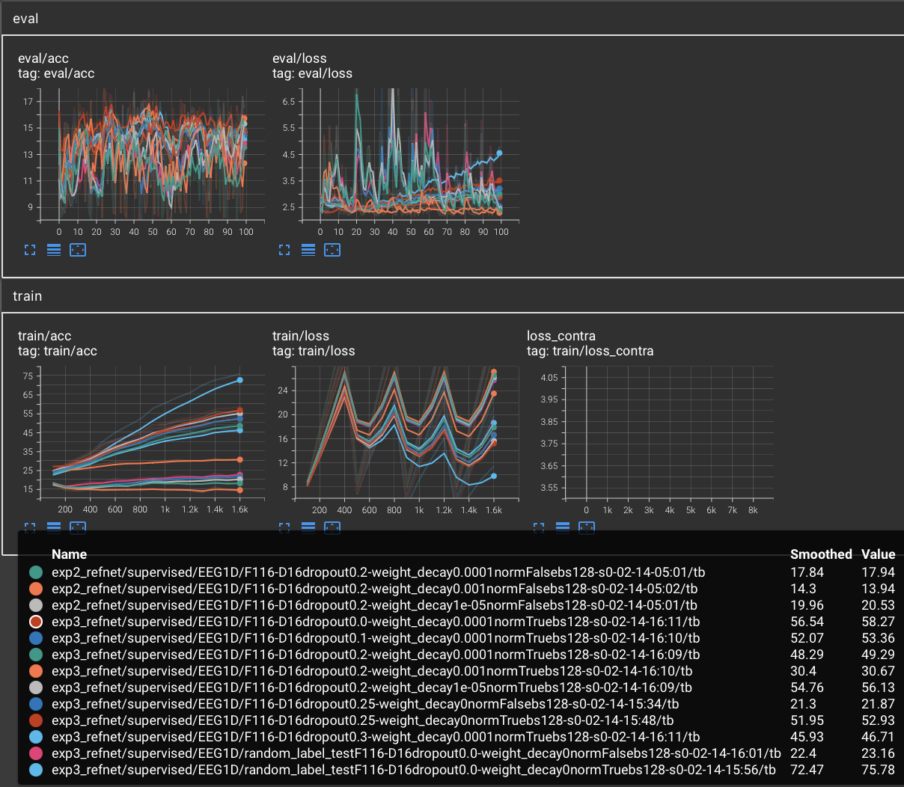
图三

图三中的还实验检验了weight_decay有着和dropout类似的减少拟合训练数据的结果。值得注意的是，我们在实验中观察到测试准确率一直较低（最高只有18%左右），为了探究问题所在，我们增加了 random_label_test 实验，即将训练集中的数据标签随机打乱后用来训练模型。实验发现这样打乱后准确率大概在15%左右，与按照正确标签训练没有显著区别。这一实验一方面体现了深度神经网络强大的拟合能力，另一方面也说明我们目前采用的问题很可能存在着较大的问题。我们认为这可能和三个因素有关：1. EEG1D 直接将最后特征展品用于分离还是参数量过大，容易过拟合； 2. 原始数据有待近一步处理；3. 跨个体识别问题自身的困难。我们首先在未经处理过的数据集上进一步开展了对比学习。

另外值得注意到是图 1～3 中记录的 train loss 曲线虽然在经过 smooth 后整体呈现下降趋势，但是存在着很大的波动；这与前文提到的连续使用batch中30s数据来训练可能带来的问题对应。

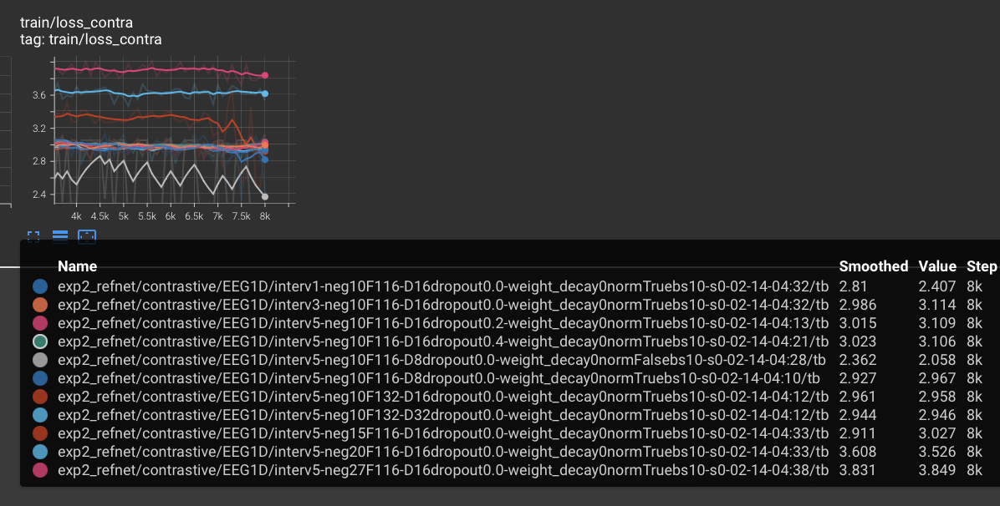
图四

图四中主要展示了neg_sample数量对于contrastive learning的影响；可以看到 neg_sample 数量越多，loss整体越大，这和计算 contrastvie loss 公式的性质相符。此外我们注意未经 normalize 的数据波动较大。

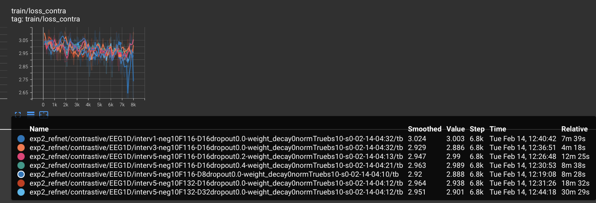
图五

图五主要展示了网络大小和dropout的影响，可以看到二者对于训练影响较小。此外图五中还体现了 sample_interval 对于训练的影响，我们将其进一步放大在了图六中展示。可以看到，interval 只取1时训练波动较大，取3和5时都相对较小。

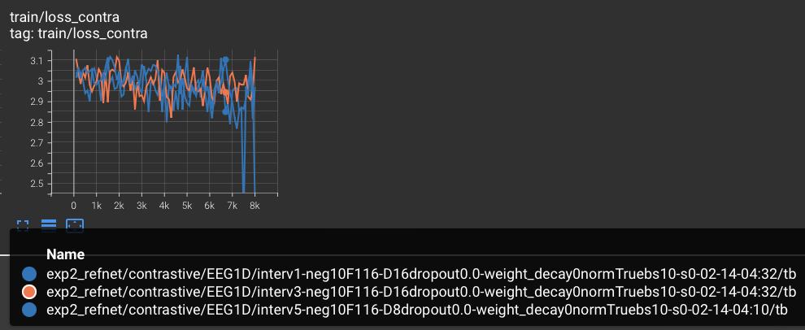
图六

### 在预处理过的数据集上测试

此部分我们在经过预处理的数据集上测试之前认为模型效果不好的原因。

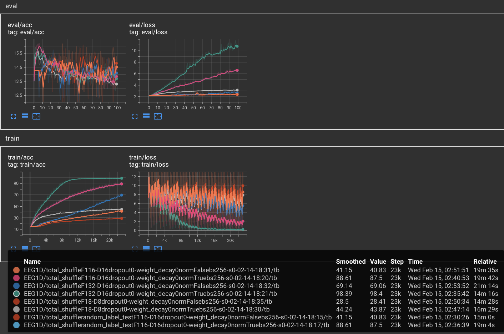
图七

图七展示了使用 `--total_shuffle` 后的结果，可以看到相比之前的训练曲线，训练loss下降的大周期波动改为了小周期波动。

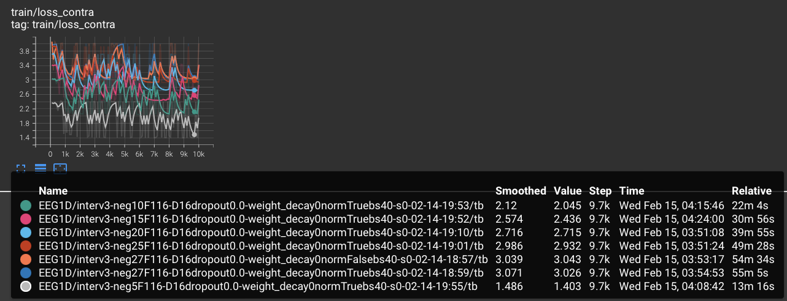
图八
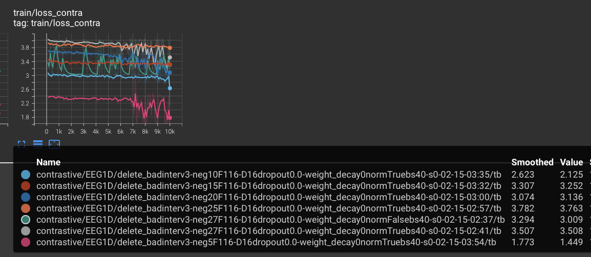
图九
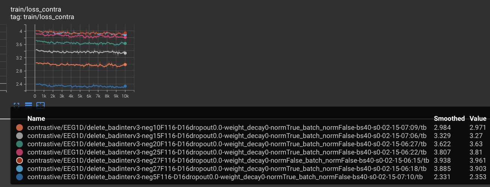

图八~十分别展示了不同设置下contrastive learning中loss曲线的变化，其中图八为只进行数据预处理，图九为在预处理的基础上去除坏道，图十为在图九的基础上让网络不使用batch norm。可以看到，经过预处理后再对输入数据进行标准化处理对于训练曲线影响就较小了（图四中未normalize的曲线与其它曲线明显不同），而图八～十中无明显区别。此外对比图八和图九可以发现，去除坏样本对于训练稳定较为关键（数据预处理时发现80位被试的数据中有两份几乎用不了，而在我们进行cotrastive learning时取batch_size=40时，这就意味着平均每次跟新都会用到坏的数据，这也使得去除这两个坏样本后的图九的曲线更平稳）。

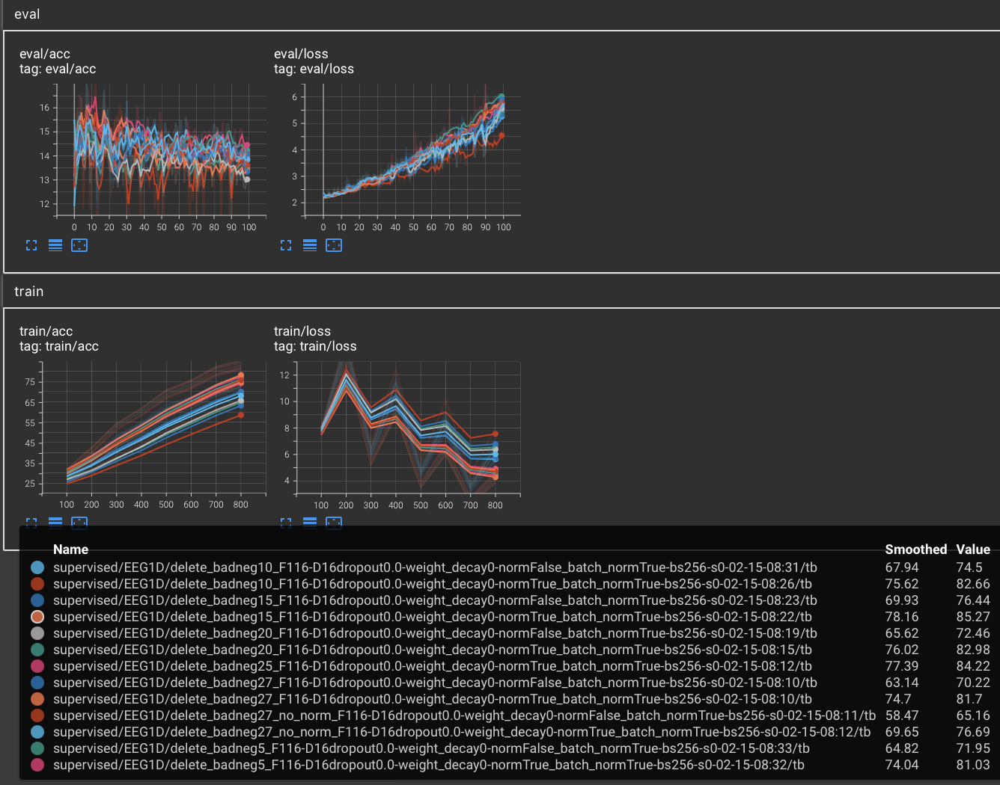
图十

图十中展示了经过contrastive learning后再进行supervised learning的结果，可以看到相对图三和图七中的曲线，经过normalize的曲线与未经过基本一致，且训练loss下降得也更加稳定，这说明我们的contrastive预训练是有帮助的。

然而在所有的实验中我们发现模型在测试数据上最好的准确率只有18%左右，和经过打乱的标签结果基本一致（即使经过预处理及对比学习），这和训练集上的效果形成了鲜明的对比。我们认为，除了数据本身的问题和我们在处理数据时将标签和数据错误匹配等可能外，还有可能是我们设计的模型并不能很好得提取EEG信号的特征，特别是最后使特征降维的操作。虽然我们也尝试了[^1]中的DE方法，但是可能由于缺乏近一步的特征平滑等操作，我们发现在训练过程中很容易出现loss发散的现象。

## 小结

我们在不同程度的数据预处理和不同的网络结构、训练方法下开展实验，发现了在处理直接来自现实实验的EEG数据时预处理的重要性。虽然可能由于数据使用和网络设计等问题测试准确率不理想，但是我们仍然检验了batch norma、contrastive learning 等常见因素在现实问题中的有趣影响。

[^1]: Contrastive Learning of Subject-Invariant EEG Representations for Cross-Subject Emotion Recognition

[^2]: EEGNet: A Compact Convolutional Neural Network for EEG-based Brain-Computer Interfaces
